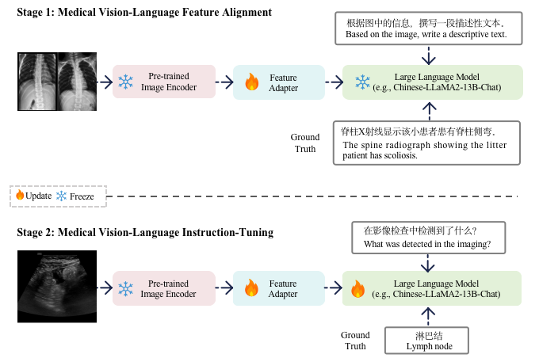

# Qilin-Med-VL: Towards Chinese Large Vision-Language Model for General Healthcare

> Junling Liu, Ziming Wang, Qichen Ye, Dading Chong, Peilin Zhou, Yining Hua

## 📖 Introduction
Large Language Models (LLMs) have introduced a new era of proficiency in comprehending complex healthcare and biomedical topics. However, there is a noticeable lack of models in languages other than English and models that can interpret multi-modal input, which is crucial for global healthcare accessibility. In response, this study introduces Qilin-Med-VL 1 , the first Chinese large vision-language model designed to integrate the analysis of textual and visual data. Qilin-Med-VL combines a pre-trained Vision Transformer (ViT) with a foundational LLM. It undergoes a thorough two-stage curriculum training process that includes feature alignment and instruction tuning. This method enhances the model's ability to generate medical captions and answer complex medical queries. We also release ChiMed-VL, a dataset consisting of more than 1M image-text pairs. This dataset has been carefully curated to enable detailed and comprehensive interpretation of medical data using various types of images.

## ✅ Todo

- [ ] training scripts
- [ ] training data
- [ ] models

## 📚 Datasets

- ChiMed-VL-Alignment

- ChiMed-VL-Instruction

## Acknowledgement

Many thanks to the following awesome works!

- [LLaVA](https://github.com/haotian-liu/LLaVA)
- [Transformers](https://github.com/huggingface/transformers)